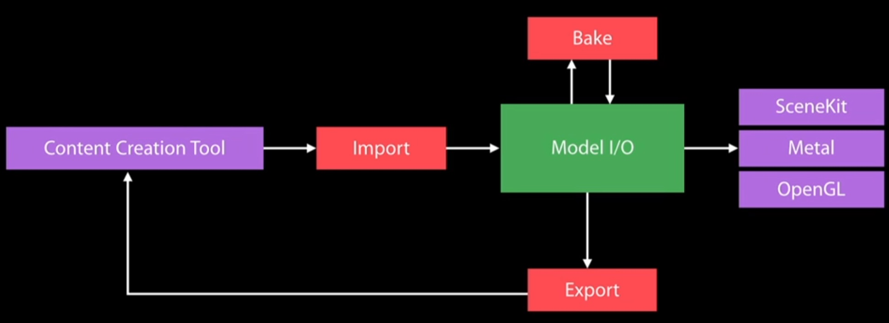
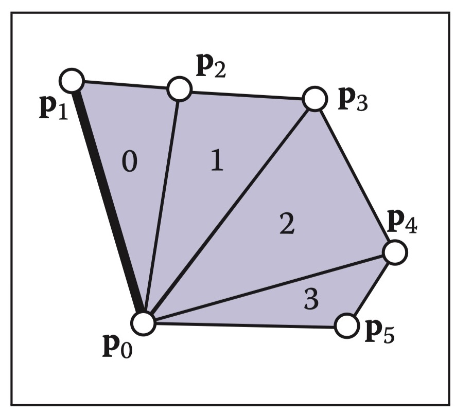
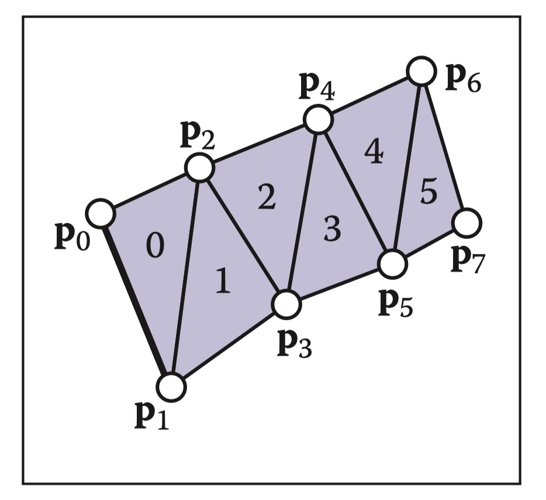

在前面的几篇文章中我们都是手动输入顶点数据(立方体)或者使用代码生成的方式(球面)创建模型，可以看到这种创建模型的方式非常繁琐且极其局限，无法在真正的工程里使用，你能想象用这种方式创建一个人体模型吗？

从程序员的角度来看，模型数据属于一种资源文件，就像图片资源那样，由专业的人员创建，保存成某种格式的文件，该文件包含了一切必要的数据，例如，顶点坐标、顶点法向量等，我们只要读取这种文件后就可以直接用来绘制。

本文主要介绍上面提到的3D模型格式以及Apple官方提供的读取模型的库Model I/O，最后通过Model I/O绘制一个复杂的模型。完整的源码可以参考[github](https://github.com/zack2012/MetalGraphics)。

## 1、3D文件格式

3D文件格式种类繁多，就像图片文件格式一样，这里不打算全部介绍一遍，只介绍我认为比较重要的格式。


##### 1.1 Alembic

文件后缀名为.abc, 由大名鼎鼎的[工业光魔ILM](https://baike.baidu.com/item/工业光魔公司/7652141?fromtitle=ILM&fromid=44269&fr=aladdin)、Sony Pictures与Imageworks共同开发的一种开放格式。该格式主要解决的问题是在不同的软件之间共享复杂的动态场景，Alembic不仅能导出模型，还能导出特效，最早开发出来是用在电影cg特效里，后面游戏引擎也开始支持该格式。

##### 1.2 glTF

文件后缀名为.gltf，glTF是一种可以减少3D格式中与渲染无关的冗余数据并且在更加适合OpenGL簇加载的一种3D文件格式。它的提出是源自于3D工业和媒体发展的过程中，对3D格式统一化的急迫需求。在其[官网](https://www.khronos.org/gltf/)里把glTF比作三维文件的JPEG。

glTF使用json格式进行描述，也可以编译成二进制的内容：bglTF。glTF可以包括场景、摄像机、动画等，也可以包括网格、材质、纹理，甚至包括了渲染技术（technique）、着色器以及着色器程序。同时由于json格式的特点，它支持预留一般以及特定供应商的扩展。

##### 1.3 STL

文件后缀名为.stl，STL文件是在计算机图形应用系统中，用于表示三角形网格的一种文件格式。它格式非常简单，只能用于描述三维物体的几何信息，不支持颜色材质等信息。该格式最早发布于1987年，运用领域非常广泛。

##### 1.4 OBJ

文件后缀名为.obj，OBJ文件是Alias|Wavefront公司为它的一套基于工作站的3D建模和动画软件"Advanced Visualizer"开发的一种标准3D模型文件格式，很适合用于3D软件模型之间的互导。目前几乎所有知名的3D软件都支持OBJ文件的读写。OBJ文件是一种文本文件，可以直接用写字板打开进行查看和编辑修改。

OBJ文件除了包含基本模型数据，还附带UV信息及材质路径，但它不包含动画、材质特性、贴图路径、动力学、粒子等信息。主要支持多边形(Polygons)模型。是最受欢迎的格式。

##### 1.5 PLY

文件后缀名为.ply，PLY格式全称为Polygon File Format或者 Stanford Triangle Format。它受Wavefront .obj格式的启发，但改进了Obj格式所缺少的对任意属性及群组的扩充性。因此PLY格式发明了"property"及"element"这两个关键词，来概括“顶点、面、相关资讯、群组”的概念。

PLY主要用以储存立体扫描结果的三维数值，透过多边形片面的集合描述三维物体，与其他格式相较之下这是较为简单的方法。它可以储存的资讯包含颜色、透明度、表面法向量、材质座标与资料可信度，并能对多边形的正反两面设定不同的属性。

##### 1.6 USD

文件后缀名为.usd，USD全称为Universal Scene Description，该格式由Pixar开发。对于需要稳定地，可扩展地交换和增强由一系列基本asset组成的任意3D场景而言，USD可以满足这种需求。[官网](https://graphics.pixar.com/usd/docs/index.html)有该格式的详细介绍。

WWDC 2018上，苹果宣布与Pixar共同开发了一款新的格式USDZ，USDZ实质上就是USD格式的压缩版，最后的Z代表着zip，苹果希望USDZ成为AR领域的通用格式。

## 2、Model I/O

Model I/O是苹果在2015年推出的一款处理3D模型的框架，它不仅可以用来导入、导出、操作3D模型，还可以用来描述灯光,材料和环境，烘焙灯光，细分网格,提供基于物理效果的渲染。Model I/O与苹果其他的框架(SceneKit、Metal)集成的很好，使用起来非常简单。在开发过程使用Model I/O如下图所示：

 

Model I/O功能强大，这里我们不做全面的介绍，只介绍与导入模型相关的内容，等到以后用到其他功能时再详细展开。

##### 2.1 导入模型

使用Model I/O的第一步就是导入模型，代码很简单：

```swift
let asset = MDLAsset(url: url, vertexDescriptor: vertexDescriptor, bufferAllocator: bufferAllocator)
```
第一个参数URL是模型的路径，第三个参数是MDLMeshBufferAllocator，使用MDLAssert加载MDLMesh时必须创建MDLMeshBufferAllocator，否则会失败，创建的代码很简单:

```swift
let bufferAlloctor = MTKMeshBufferAllocator(device: self.device)
```

第二个参数是MDLVertexDescriptor，它与Metal里的MTLVertexDescriptor相对应。创建的代码如下：

```swift
let mtlVertexDesc = MTLVertexDescriptor()
// position
mtlVertexDesc.attributes[0].format = .float3
mtlVertexDesc.attributes[0].offset = 0
mtlVertexDesc.attributes[0].bufferIndex = 0

// normal
mtlVertexDesc.attributes[1].format = .float3
mtlVertexDesc.attributes[1].offset = 12
mtlVertexDesc.attributes[1].bufferIndex = 0

// layout
mtlVertexDesc.layouts[0].stride = 24
mtlVertexDesc.layouts[0].stepFunction = .perVertex

let mdlVertexDesc = try! MTKModelIOVertexDescriptorFromMetalWithError(mtlVertexDesc)
       
// attribute.name must be set, or draw call will failed
var attribute = mdlVertexDesc.attributes[0] as! MDLVertexAttribute
attribute.name = MDLVertexAttributePosition
attribute = mdlVertexDesc.attributes[1] as! MDLVertexAttribute
attribute.name = MDLVertexAttributeNormal
```
上面的代码先创建MTLVertexDescriptor实例，在通过函数MTKModelIOVertexDescriptorFromMetalWithError创建MDLVertexDescriptor实例，使用MTKModelIOVertexDescriptorFromMetalWithError需要注意的由：该函数只能用在iOS 10以上，创建出来的MDLVertexDescriptor后**必须**设置attribute.name属性的值，否则在后面创建mesh时会失败。如果需要支持iOS 9怎么办？可以用以下代码创建MDLVertexDescriptor：

```swift
let mdlVertexDesc = MDLVertexDescriptor()
        
// position
var attr = MDLVertexAttribute(name: MDLVertexAttributePosition,
                              format: .float3,
                              offset: 0,
                              bufferIndex: 0)
mdlVertexDesc.addOrReplaceAttribute(attr)
        
// normal
attr = MDLVertexAttribute(name: MDLVertexAttributeNormal,
                          format: .float3,
                          offset: 12,
                          bufferIndex: 0)
mdlVertexDesc.addOrReplaceAttribute(attr)
        
let layout = MDLVertexBufferLayout(stride: 24)
mdlVertexDesc.layouts[0] = layout
```

可以看到，直接创建MDLVertexDescriptor与之前的创建方法并无本质区别，代码上甚至更加简洁(实际项目里的代码需要处理错误，不能简单的使用try!)，那苹果为什么要在iOS 10上添加MTKModelIOVertexDescriptorFromMetalWithError函数？我想是因为创建MDLVertexDescriptor的参数必须与MTLVertexDescriptor一一对应，如果哪天要修改参数时只要改一处地方，这样易于维护。

现在我们来详细介绍下MTLVertexDescriptor，MTLVertexDescriptor是用来描述顶点数据buffer结构、类型、布局的类。我们知道顶点数据不仅包括顶点的位置坐标，还包含很多其他的数据，我们把这些数据称为属性(attribute)，例如，一个顶点数据可以有坐标属性、法向量属性、颜色属性等，我们可以任意的往顶点数据里添加合适的属性。当应用向GPU传输这些顶点数据时，或者更具体的说，向vertex shader函数传输参数时，是通过一块块连续的内存空间来完成，也就是vertex buffer。

为了方便理解，我们举个例子，假设现在我们有两个顶点A、B，每个顶点有两个属性：
  1、位置属性position，类型为float3。
  2、法向量属性normal，类型为float3。  
  
float3由simd库提供，每个float3由3个float类型组成，在内存中占据3 * 4 = 12个字节。我们将A、B两个顶点数据存储到如下的buf里
     A                   B
|---------|---------|---------|---------|
 position   normal   position   normal
|---------|---------|---------|---------|

<--------------- 24 bytes --------------->

通过下面代码向vertex shader函数传输参数：

```swift
let verticsBuffer = device.makeBuffer(bytes: &buf, length: 24, options: .storageModeShared)
encoder.setVertexBuffer(verticsBuffer, offset: 0, index: 0)
```  

vertex shader对应的函数签名为：

```cpp
struct VertexOut {
    float4 position [[position]];
    float4 color;
};

struct VertexInput {
    float3 position;
    float3 normal;
};

vertex VertexOut vertexShader(uint vid [[vertex_id]],
                              device VertexInput *vertics [[buffer(0)]],
                             )
```

在应用设置的index，对应vertex shader里的[[buffer(index)]]，[[vertex_id]]表示则当前第几个顶点。这种传输方式有着一个明显的缺点，不够灵活，所以Metal给了另外一种传输方式：

```swift
let renderPipelineDesc = MTLRenderPipelineDescriptor()

let mtlVertexDesc = MTLVertexDescriptor()
// position
mtlVertexDesc.attributes[0].format = .float3
mtlVertexDesc.attributes[0].offset = 0
mtlVertexDesc.attributes[0].bufferIndex = 0

// normal
mtlVertexDesc.attributes[1].format = .float3
mtlVertexDesc.attributes[1].offset = 12
mtlVertexDesc.attributes[1].bufferIndex = 0

// layout
mtlVertexDesc.layouts[0].stride = 24
mtlVertexDesc.layouts[0].stepFunction = .perVertex

renderPipelineDesc.vertexDescriptor = mtlVertexDesc

// ...

encoder.setVertexBuffer(verticsBuffer, offset: 0, index: 0)
```

vertex shader对应的函数签名为：

```cpp
struct VertexOut {
    float4 position [[position]];
    float4 color;
};

struct VertexInput {
    float3 position [[attribute(0)]];
    float3 normal [[attribute(1)]];
};

vertex VertexOut vertexShader(VertexInput vertexIn [[stage_in]])
```

无论采取哪种方式传输数据，应用程序最终都是通过setVertexBuffer来向vertex shader传输参数的。那么vertex shader如何获取数据生成VertexInput结构体？需要做2件事：  

 1、在vertex shader函数对应参数后面添加[[stage_in]]属性，[[stage_in]]表示该参数可以从不同的buffer(index)里读取数据，具体哪个属性从哪个buffer里读取由MTLVertexDescriptor设置，比如：  

```swift
mtlVertexDesc.attributes[0].bufferIndex = 0
mtlVertexDesc.attributes[1].bufferIndex = 0
```
表示VertexInput的两个属性position和normal都从buffer(0)里读取。如果设置

```swift
mtlVertexDesc.attributes[0].bufferIndex = 0
mtlVertexDesc.attributes[1].bufferIndex = 1
```
则表示VertexInput的position字段从buffer(0)读取，normal字段从buffer(1)读取，这也要求应用需要提供两个vertex buffer。

 2、在vertex shader里参数类型的每个字段后面添加对应的属性[[attribute(index)]]，index的值就是我们在设置MTLVertexDescriptor时的值，比如这行代码
 
 ```swift
 mtlVertexDesc.attributes[0].format = .float3
 ```
 表示[[attribute(0)]]的字段必须为float3类型。

MTLVertexDescriptor另外的几个属性值设置如何读取内存。

```swift
mtlVertexDesc.layouts[0].stride = 24
mtlVertexDesc.layouts[0].stepFunction = .perVertex
```

stride设置每个顶点数据的长度，VertexInput由两个float3组成，所以每个顶点数据的长度是24字节，stepFunction设置vertex shader获取这个属性的方式，比如.perVertex表示每个顶点都获取一次，.constant表示这个属性只获取一次，以后都使用这次获取的值。通常我们都使用.perVertex。

```swift
mtlVertexDesc.attributes[0].offset = 0
mtlVertexDesc.attributes[1].offset = 12
```

表示每个属性应从顶点数据里的第几个字节开始读取，VertexInput长度为24个字节，attributes(0)从第0个字节开始读取，attribute(1)从第12个字节开始读取。

如果我们使用2个buffer来存储数据，那代码如下：

```swift
// make MTLVertexDescriptor
let mtlVertexDesc = MTLVertexDescriptor()
        
// position
mtlVertexDesc.attributes[0].format = .float3
mtlVertexDesc.attributes[0].offset = 0
mtlVertexDesc.attributes[0].bufferIndex = 0
        
// normal
mtlVertexDesc.attributes[1].format = .float3
mtlVertexDesc.attributes[1].offset = 0
mtlVertexDesc.attributes[1].bufferIndex = 1
        
mtlVertexDesc.layouts[0].stride = 12
mtlVertexDesc.layouts[0].stepFunction = .perVertex
        
mtlVertexDesc.layouts[1].stride = 12
mtlVertexDesc.layouts[1].stepFunction = .perVertex

// make MDLVertexDescriptor
let mdlVertexDesc = MDLVertexDescriptor()
        
// position
var attr = MDLVertexAttribute(name: MDLVertexAttributePosition,
                              format: .float3,
                              offset: 0,
                              bufferIndex: 0)
mdlVertexDesc.addOrReplaceAttribute(attr)
        
// normal
attr = MDLVertexAttribute(name: MDLVertexAttributeNormal,
                          format: .float3,
                          offset: 0,
                          bufferIndex: 1)
mdlVertexDesc.addOrReplaceAttribute(attr)
        
var layout = MDLVertexBufferLayout(stride: 12)
mdlVertexDesc.layouts[0] = layout

layout = MDLVertexBufferLayout(stride: 12)
mdlVertexDesc.layouts[1] = layout
```

##### 2.2 生成Mesh

成功创建好MDLAsset后，就可以用它来生成Mesh，代码如下：

```swift
(_, self.dragonMeshes) = try! MTKMesh.newMeshes(asset: dragon, device: self.device)
```

MTKMesh.newMeshes返回两个值，第一个值为[MDLMesh]，在Metal并没有用到，所以忽略它，第二个值为[MTKMesh]，用来完成draw call。在介绍MTKMesh之前我们要先了解什么是Mesh。

现实世界中的物体表面都是由曲面构成的，而在计算机世界里，我们用无数小的三角形去模拟这些曲面，只要数量足够多，我们肉眼看上去就像光滑的曲面。这些三角形共享顶点，我们把这样的拓扑结构叫做三角形网格(Triangle Mesh)。

描述三角形网格一般有两种数据结构：索引三角形网格和扇形或带状三角形网格。索引三角形网格的数据结构可以表示为：

```cpp
struct IndexedMesh {
    int index[nt][3];
    Vectex vecties[nv];
}
```

其中vecties表示三角形网格的顶点数据数组，index[i][k]表示第i个三角形的第k个顶点，使用索引三角形网格的好处是该结构简单，同时比直接存储三角形数组的数据结构要省一半的内存。

扇形或带状三角形网格则比索引三角形网格更加节省内存，扇形或带状三角形网格示意图如下：

 

 

以图中扇形三角形网格为例，只要6个顶点数据就可以完整描述，因此它比索引三角形网格更加节省内存。

了解了什么是Mesh后，我们在来看MTKMesh，查看它的初始化API可以发现，MTKMesh必须配合Model I/O框架使用，MTKMesh本身也不属于Metal，而是MetalKit这个框架下的类。MTKMesh有两个属性值得注意，一个是submeshes，它是MTKSubmesh类型的数组，另一个是vertexBuffers，是MTKMeshBuffer类型的数组。我们在使用调用Metal draw call就是通过这个两个属性来完成绘制的。

