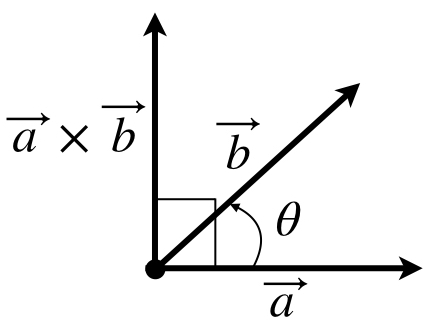

从2D转向3D，首先遇到的问题就是如何在2D平面内表示一个3D物体，如果对美术有所了解的话，就会知道这个问题已经在200多年前就被很好的解决了。

## 1. 数学知识

坐标变化主要用到的数学知识有：向量、矩阵。
#### 1.1 向量  

$$
\vec{a}+\vec{b}=\vec{b}+\vec{a}
$$

$$
(\vec{a}+\vec{b})+\vec{c}=\vec{a}+(\vec{b}+\vec{c})
$$  

$$  
(kt)\vec{a}=k(t\vec{a})
$$

$$
k(\vec{a}+\vec{b})=k\vec{a}+k\vec{b}
$$  

$$
(s+t)\vec{a}=s\vec{a}+t\vec{a}
$$  

设

$$
\vec{a}=(a_1,a_2,a_3,\dots,a_n)  
$$

则向量的长度定义为：  

$$
|\vec{a}|=\sqrt{a_1^2+a_2^2+a_3^2+\cdots+a_n^2}
$$

长度性质:

$$
|k\vec{a}|=|k|||\vec{a}|
$$

$$
|\vec{a}+\vec{b}|\leq|\vec{a}|+|\vec{b}|
$$

向量点积:  

$$
\vec{a}\cdot\vec{b}=a_1b_1+a_2b_2+a_3b_3+\cdots+a_nb_n
$$

$$
\vec{a}\cdot\vec{b}=|\vec{a}||\vec{b}|\cos\theta
$$

$\theta$为向量$\vec{a}$,$\vec{b}$的夹角，如下图所示:  

  

由点积的公式可以知道，如果两个向量垂直(正交)，则  

$$
\vec{a}\cdot\vec{b}=0
$$

点积性质:

$$
\vec{a}\cdot\vec{b}=\vec{b}\cdot\vec{a}
$$

$$
(k\vec{a})\cdot\vec{b}=k(\vec{a}\cdot\vec{b})
$$

$$
\vec{a}\cdot(\vec{b}+\vec{c})=\vec{a}\cdot\vec{b}+\vec{a}\cdot\vec{c}
$$

$$
\vec{a}\cdot\vec{a}=|\vec{a}|^2
$$

$$
|\vec{a}\cdot\vec{b}|\leq|\vec{a}||\vec{b}|
$$

向量叉积定义:  

$$
\vec{a}\times\vec{b}=(a_2b_3-a_3b_2,a_3b_1-a_1b_3,a_1b_2-a_2b_1)
$$  

$$
|\vec{a}\times\vec{b}|=|\vec{a}||\vec{b}|\sin\theta
$$
注意，叉积与点积不同，以上定义不能轻易扩展到n维，只适用于3维向量。

向量叉积示意图:  
  
向量叉积产生一个新的向量，该向量与原来的两个向量垂直(正交)，方向满足右手定则。  

由叉积公式可以知道，如果$\vec{a}$, $\vec{b}$平行，则:  

$$
\vec{a}\times\vec{b}=\vec{0}
$$  

向量叉积性质:  

$$
\vec{a}\times\vec{b}=-(\vec{b}\times\vec{a})
$$

$$
(k\vec{a})\times\vec{b}=k(\vec{a}\times\vec{b})
$$

$$
\vec{a}\times(\vec{b}+\vec{c})=\vec{a}\times\vec{b}+\vec{a}\times\vec{c}
$$

$$
\vec{a}\times\vec{a}=\vec{0}
$$

$$
(\vec{a}\times\vec{b})\cdot\vec{c}=(\vec{c}\times\vec{a})\cdot\vec{b}=(\vec{b}\times\vec{c})\cdot\vec{a}
$$

$$
\vec{a}\times(\vec{b}\times\vec{a})=\vec{a}\times\vec{b}\times\vec{a}=|\vec{a}|^2\vec{b}-(\vec{a}\cdot\vec{b})\vec{a}
$$  

#### 1.2 矩阵  
矩阵性质:  

$$  
\mathbf{F}+\mathbf{G}=\mathbf{G}+\mathbf{F}
$$

$$
(\mathbf{F}+\mathbf{G})+\mathbf{H}=\mathbf{F}+(\mathbf{G}+\mathbf{H})
$$

$$
k(s\mathbf{F})=(ks)\mathbf{F}
$$

$$
k(\mathbf{F}+\mathbf{G})=k\mathbf{F}+k\mathbf{G}
$$

$$
(k+s)\mathbf{F}=k\mathbf{F}+s\mathbf{F}
$$

$$
(k\mathbf{F})\mathbf{G}=k(\mathbf{F}\mathbf{G})
$$

$$
(\mathbf{F}\mathbf{G})\mathbf{H}=\mathbf{F}(\mathbf{G}\mathbf{H})
$$

$$
(\mathbf{F}\mathbf{G})^T=\mathbf{G}^T\mathbf{F}^T
$$

$$
\mathbf{F}\mathbf{F}^{-1}=\mathbf{F}^{-1}\mathbf{F}=\mathbf{I}
$$

$$
(\mathbf{F}\mathbf{G})^{-1}=\mathbf{G}^{-1}\mathbf{F}^{-1}
$$

$$
|\mathbf{F}\mathbf{G}|=|\mathbf{F}||\mathbf{G}|
$$

$$
\exists\mathbf{F}^{-1}\iff|\mathbf{F}|\neq0
$$

矩阵$\mathbf{F_{n\times n}}$有特征值:  

$$
\lambda_1,\lambda_2,\dots\lambda_n
$$

特征向量:  

$$
\vec{v}_1,\vec{v}_2,\dots,\vec{v}_n
$$

由特征向量组成的矩阵:

$$
\mathbf{A}=[\vec{v}_1,\vec{v}_2,\dots,\vec{v}_n]
$$
则:  

$$
\mathbf{F}\vec{v}_i=\lambda_i\vec{v}_i
$$

$$
\mathbf{A}^{-1}F\mathbf{A}=\begin{pmatrix}\lambda_1 & 0 & \cdots & 0\\
0 & \lambda_2 & \cdots & 0\\\vdots & \vdots & \ddots & \vdots\\0 & 0 & \cdots & \lambda_n\end{pmatrix}
$$
