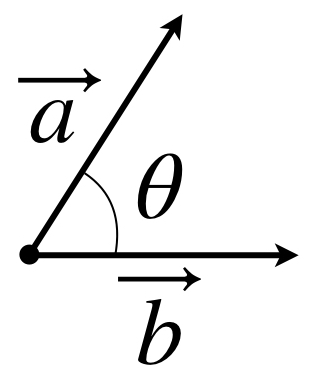

从2D转向3D，首先遇到的问题就是如何在2D平面内表示一个3D物体，如果对美术有所了解的话，就会知道这个问题已经在200多年前就被很好的解决了。

## 1. 数学知识

坐标变化主要用到的数学知识有：向量、矩阵。
#### 1.1 向量  

$$
\vec{a}+\vec{b}=\vec{b}+\vec{a}
$$

$$
(\vec{a}+\vec{b})+\vec{c}=\vec{a}+(\vec{b}+\vec{c})
$$  

$$  
(kt)\vec{a}=k(t\vec{a})
$$

$$
k(\vec{a}+\vec{b})=k\vec{a}+k\vec{b}
$$  

$$
(s+t)\vec{a}=s\vec{a}+t\vec{a}
$$  

设

$$
\vec{a}=(a_1,a_2,a_3,\dots,a_n)  
$$

$$
\vec{b}=(b_1,b_2,b_3,\dots,b_n)
$$

则向量的长度定义为：  

$$
|\vec{a}|=\sqrt{a_1^2+a_2^2+a_3^2+\cdots+a_n^2}
$$

范数的性质

$$
|k\vec{a}|=|k|||\vec{a}|
$$

$$
|\vec{a}+\vec{b}|\leq|\vec{a}|+|\vec{b}|
$$

向量的点积  

$$
\vec{a}\cdot\vec{b}=a_1b_1+a_2b_2+a_3b_3+\cdots+a_nb_n
$$

$$
\vec{a}\cdot\vec{b}=|\vec{a}||\vec{b}|\cos\theta
$$

$\theta$为向量$\vec{a}$,$\vec{b}$的夹角，如下图所示:  

  

由点积的公式可以知道，如果两个向量垂直(正交)，则  

$$
\vec{a}\cdot\vec{b}=0
$$

点积的性质

$$
\vec{a}\cdot\vec{b}=\vec{b}\cdot\vec{a}
$$

$$
(k\vec{a})\cdot\vec{b}=k(\vec{a}\cdot\vec{b})
$$

$$
\vec{a}\cdot(\vec{b}+\vec{c})=\vec{a}\cdot\vec{b}+\vec{a}\cdot\vec{c}
$$

$$
\vec{a}\cdot\vec{a}=|\vec{a}|^2
$$

$$
|\vec{a}\cdot\vec{b}|\leq|\vec{a}||\vec{b}|
$$
