从2D转向3D，首先遇到的问题就是如何在2D平面内表示一个3D物体，如果对美术有所了解的话，就会知道这个问题已经在200多年前就被很好的解决了。

## 1. 数学知识

坐标变化主要用到的数学知识有：向量、矩阵。
#### 1.1 向量  

$$
\vec{a}+\vec{b}=\vec{b}+\vec{a}
$$

$$
(\vec{a}+\vec{b})+\vec{c}=\vec{a}+(\vec{b}+\vec{c})
$$  

$$  
(kt)\vec{a}=k(t\vec{a})
$$

$$
k(\vec{a}+\vec{b})=k\vec{a}+k\vec{b}
$$  

$$
(s+t)\vec{a}=s\vec{a}+t\vec{a}
$$  

设

$$
\vec{a}=(a_1,a_2,a_3,\dots,a_n)  
$$

则向量的长度定义为：  

$$
|\vec{a}|=\sqrt{a_1^2+a_2^2+a_3^2+\cdots+a_n^2}
$$

长度性质:

$$
|k\vec{a}|=|k|||\vec{a}|
$$

$$
|\vec{a}+\vec{b}|\leq|\vec{a}|+|\vec{b}|
$$

向量点积:  

$$
\vec{a}\cdot\vec{b}=a_1b_1+a_2b_2+a_3b_3+\cdots+a_nb_n
$$

$$
\vec{a}\cdot\vec{b}=|\vec{a}||\vec{b}|\cos\theta
$$

$\theta$为向量$\vec{a}$,$\vec{b}$的夹角，如下图所示:  

  

由点积的公式可以知道，如果两个向量垂直(正交)，则  

$$
\vec{a}\cdot\vec{b}=0
$$

点积性质:

$$
\vec{a}\cdot\vec{b}=\vec{b}\cdot\vec{a}
$$

$$
(k\vec{a})\cdot\vec{b}=k(\vec{a}\cdot\vec{b})
$$

$$
\vec{a}\cdot(\vec{b}+\vec{c})=\vec{a}\cdot\vec{b}+\vec{a}\cdot\vec{c}
$$

$$
\vec{a}\cdot\vec{a}=|\vec{a}|^2
$$

$$
|\vec{a}\cdot\vec{b}|\leq|\vec{a}||\vec{b}|
$$

向量叉积定义:  

$$
\vec{a}\times\vec{b}=(a_2b_3-a_3b_2,a_3b_1-a_1b_3,a_1b_2-a_2b_1)
$$  

向量$\vec{a}$定义的反对称矩阵:  

$$
\mathbf{A}=\begin{pmatrix}0 & -a_3 & a_2\\
a_3 & 0 & -a_1\\ -a_2 & a_1 & 0 \\\end{pmatrix}
$$
则:  

$$
\vec{a}\times\vec{b} = \mathbf{A}\vec{b}
$$  

$$
|\vec{a}\times\vec{b}|=|\vec{a}||\vec{b}|\sin\theta
$$
注意，叉积与点积不同，以上定义不能轻易扩展到n维，只适用于3维向量。

向量叉积示意图:  
  
向量叉积产生一个新的向量，该向量与原来的两个向量垂直(正交)，方向满足右手定则。  

由叉积公式可以知道，如果$\vec{a}$, $\vec{b}$平行，则:  

$$
\vec{a}\times\vec{b}=\vec{0}
$$  

向量叉积性质:  

$$
\vec{a}\times\vec{b}=-(\vec{b}\times\vec{a})
$$

$$
(k\vec{a})\times\vec{b}=k(\vec{a}\times\vec{b})
$$

$$
\vec{a}\times(\vec{b}+\vec{c})=\vec{a}\times\vec{b}+\vec{a}\times\vec{c}
$$

$$
\vec{a}\times\vec{a}=\vec{0}
$$

$$
(\vec{a}\times\vec{b})\cdot\vec{c}=(\vec{c}\times\vec{a})\cdot\vec{b}=(\vec{b}\times\vec{c})\cdot\vec{a}
$$

$$
\vec{a}\times(\vec{b}\times\vec{a})=\vec{a}\times\vec{b}\times\vec{a}=|\vec{a}|^2\vec{b}-(\vec{a}\cdot\vec{b})\vec{a}
$$  

#### 1.2 矩阵  
矩阵性质:  

$$  
\mathbf{F}+\mathbf{G}=\mathbf{G}+\mathbf{F}
$$

$$
(\mathbf{F}+\mathbf{G})+\mathbf{H}=\mathbf{F}+(\mathbf{G}+\mathbf{H})
$$

$$
k(s\mathbf{F})=(ks)\mathbf{F}
$$

$$
k(\mathbf{F}+\mathbf{G})=k\mathbf{F}+k\mathbf{G}
$$

$$
(k+s)\mathbf{F}=k\mathbf{F}+s\mathbf{F}
$$

$$
(k\mathbf{F})\mathbf{G}=k(\mathbf{F}\mathbf{G})
$$

$$
(\mathbf{F}\mathbf{G})\mathbf{H}=\mathbf{F}(\mathbf{G}\mathbf{H})
$$

$$
(\mathbf{F}\mathbf{G})^T=\mathbf{G}^T\mathbf{F}^T
$$

$$
\mathbf{F}\mathbf{F}^{-1}=\mathbf{F}^{-1}\mathbf{F}=\mathbf{I}
$$

$$
(\mathbf{F}\mathbf{G})^{-1}=\mathbf{G}^{-1}\mathbf{F}^{-1}
$$

$$
|\mathbf{F}\mathbf{G}|=|\mathbf{F}||\mathbf{G}|
$$

$$
\exists\mathbf{F}^{-1}\iff|\mathbf{F}|\neq0
$$

矩阵$\mathbf{F_{n\times n}}$有特征值:  

$$
\lambda_1,\lambda_2,\dots\lambda_n
$$

特征向量:  

$$
\vec{v}_1,\vec{v}_2,\dots,\vec{v}_n
$$

由特征向量组成的矩阵:

$$
\mathbf{A}=[\vec{v}_1,\vec{v}_2,\dots,\vec{v}_n]
$$
则:  

$$
\mathbf{F}\vec{v}_i=\lambda_i\vec{v}_i
$$

$$
\mathbf{A}^{-1}F\mathbf{A}=\begin{pmatrix}\lambda_1 & 0 & \cdots & 0\\
0 & \lambda_2 & \cdots & 0\\\vdots & \vdots & \ddots & \vdots\\0 & 0 & \cdots & \lambda_n\end{pmatrix}
$$

## 2. 坐标系  

在图形学里，经常会碰到以下几个坐标系：物体空间(Object Space)、世界空间(World Space)、观察空间(View Space)、裁剪空间(Clip Space)、标准化设备坐标系(Normalized Device Coordinate, NDC)以及屏幕空间(Screen Space)。以下一一介绍这些坐标系。

#### 2.1 物体空间

物体空间是指对象建模时的坐标系，用来描述物体内部之间的位置关系。例如，创建一个球体时，可以选取任意点作为球心，但取坐标系的原点可以简化方程。  

#### 2.2 世界空间  

当描述多个物体之间的位置关系时，物体空间就不再适用了，需要一个新的坐标系，这个坐标系就是世界空间。  

世界空间没有任何特殊的地方，可以选取任意坐标系作为世界空间，世界空间和物体空间也是相对的，例如，在描述地球上的物体的位置关系时，可以选择地球作为世界空间，但研究地球与火星的位置关系时，选择太阳作为世界空间就更合适，此时地球空间就转换为了物体空间。

#### 2.3 观察空间

同一个物体，站在不同的角度观察，就会得到不同的图像。观察空间就是用来描述物体与观察点之间的位置关系。

观察空间可以用如下方法生成：  
1、指定观察点$vrp$为坐标系的原点。  
2、指定垂直于成像平面的向量为$\vec{n}$轴方向。  
3、指定观察点的上方$\vec{v}_{up}$，注意，该向量没有必要与$\vec{n}$垂直。  
4、由下面公式得到$\vec{u}$，$\vec{v}$:    

$$
\vec{u}=\vec{v}_{up}\times\vec{n}
$$  

$$
\vec{v}=\vec{n}\times\vec{u}
$$  

5、把以上得到向量归一化后我们就得到了观察空间。  

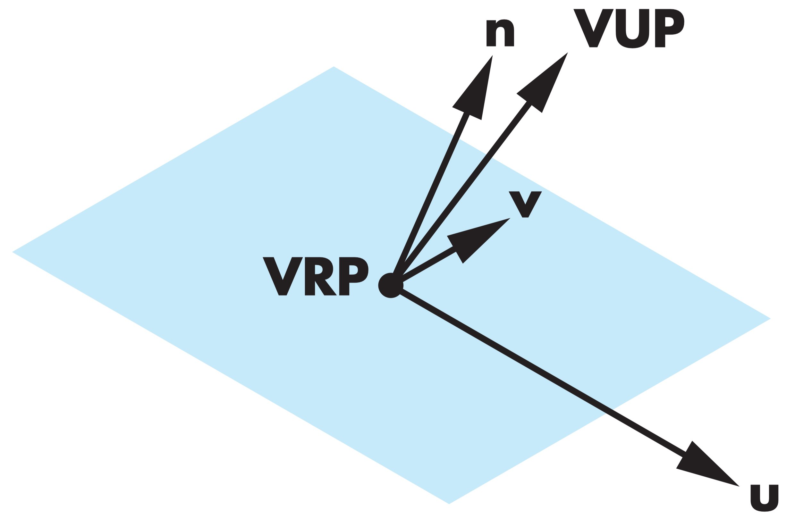  

#### 2.4 裁剪空间  

裁剪空间又称规范视见体(Canonical View Volume)。它是由下面平面所定义的立方体:  

$$
x=\pm1
$$

$$
y=\pm1
$$

$$
z=\pm1
$$  

为什么要使用规范视见体？  

一个显而易见的优点是它简化了裁剪过程。判断一个物体是否在各面平行于坐标轴的立方体内是非常简单的，只需要比较$x$，$y$，$z$的值即可。

为了了解规范视见体的另一个优点，我们必须先知道投影规范化(projection normalization)技术。如下图所示:  

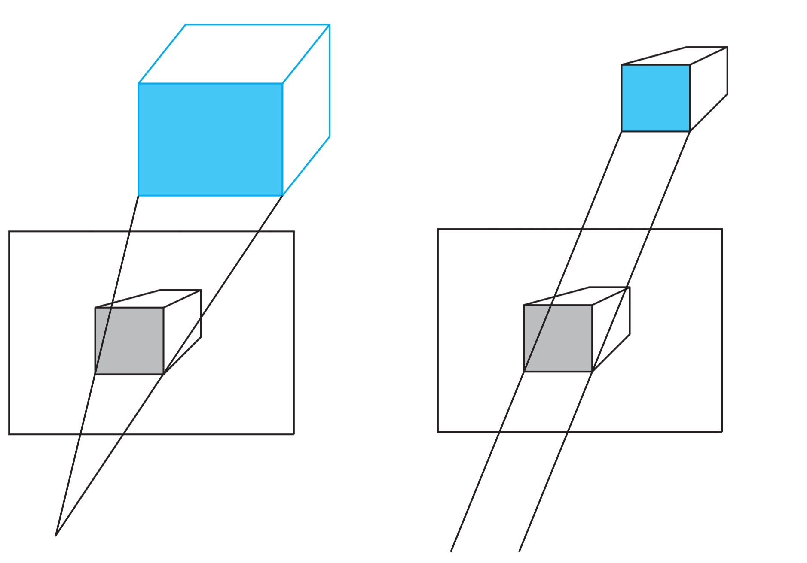  

投影规范化先把对象变形，使得变形后的对象的正交投影与与原来想要得到的投影图相同，这样就把所有的投影都转换为正交投影。这里扭曲变形由规范化矩阵(normalization matrix)来执行。

因此，在从观察空间变换到规范视见体时，只要加载合适的规范化矩阵，就可以使相同的流水线既支持平行投影又支持透视投影。

#### 2.5 标准化设备坐标系  

裁剪空间里的坐标是齐次坐标:  

$$
p=(x,y,z,w)
$$

因此，还需要从该坐标里提取出3维空间中的点:  

$$
q=(\frac{x}w,\frac{y}w,\frac{z}w,1)
$$  

裁剪空间通过以上变换得到就是标准化设备坐标系。在OpenGL里，NDC的范围为:  

$$
-1\leq x\leq1
$$

$$
-1\leq y\leq1
$$

$$
-1\leq z\leq1
$$

而在Metal、Direct3D里，NDC的范围为:  

$$
-1\leq x\leq1
$$

$$
-1\leq y\leq1
$$

$$
0\leq z\leq1
$$

#### 2.6 屏幕坐标系

NDC坐标最后还需要通过视口变换(viewport transformation)得到屏幕坐标，屏幕坐标的单位是像素。  

通过以上介绍可以知道，从3维空间到2维空间的坐标变换是一步一步串联起来的，每一步都对应着一个坐标空间。完整的流程如下图所示:  

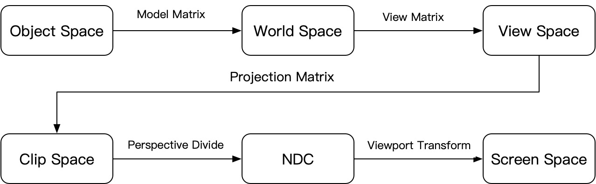  

## 3. 坐标变换

复杂的坐标变换可以由一系列简单的坐标变换矩阵相乘得到，下面先介绍一些常用的坐标变换公式。

#### 3.1 仿射坐标系  

坐标系的实质是空间的点到有序数组的对应关系，因此建立坐标系首先需要建立一个参考系，即坐标标架。

确定一个仿射标架需要3个不共面的向量以及一个定点，我们可以用如下记号表示一个仿射标架:  

$$
(\vec{x},\vec{y},\vec{z},O)
$$

则在这个坐标系下的任意一点都可以表示为:

$$
P=x\vec{x}+y\vec{y}+z\vec{z}+O
$$

即点P的坐标为:

$$
P=(x,y,z,1)
$$

像这样用4个实数表示一个3维空间中的点叫做齐次坐标(最后一维的1是上面公式中O的系数)。

在仿射坐标系下，向量可以由两个点相减得到: 

$$
\overrightarrow{OA}=A-O=(x,y,z,0)
$$

因此，在齐次坐标下，可以区别一个坐标是点还是向量。

我们可以对齐次坐标进行扩展，使得最后一维不是1，例如:

$$
P=(wx,wy,wz,w)
$$

从这个齐次坐标下提取3维空间中的点只要用第4维去除前3维就可以得到。

这样在3维空间中点在齐次坐标下就有多种表示，它们之间相差一个常系数:

$$
(x,y,z)\sim(x,y,z,1)\sim(wx,wy,wz,w)
$$

假设我们有两个仿射标架$(\vec{x},\vec{y},\vec{y},O)$和$(\vec{u},\vec{v},\vec{w},E)$，已知:

$$
\vec{u}=u_x\vec{x}+u_y\vec{y}+u_z\vec{z}+E_x
$$

$$
\vec{v}=v_x\vec{x}+v_y\vec{y}+v_z\vec{z}+E_y
$$

$$
\vec{w}=w_x\vec{x}+w_y\vec{y}+w_z\vec{z}+E_z
$$

空间中点P在$(\vec{u},\vec{v},\vec{w},E)$标架下的表示为:  

$$
P_{uvw}=(u,v,w,1)
$$

则在$(\vec{x},\vec{y},\vec{z},O)$下的表示为:

$$
P_{xyz}=
\begin{pmatrix}
u_x & v_x & w_x & E_x\\
u_y & v_y & w_y & E_y\\
u_z & v_z & w_z & E_z\\
0   & 0   & 0   & 1    
\end{pmatrix}P_{uvw}
$$

#### 3.2 缩放  

缩放可以用以下矩阵表示:  

$$
scale=\begin{pmatrix}
s_x & 0   & 0   & 0\\
0   & s_y & 0   & 0\\
0   & 0   & s_z & 0\\
0   & 0   & 0   & 1\\
\end{pmatrix}
$$  

$s_x$, $s_y$, $s_z$可以为负值，如果是负值就是对某个平面的反射。变换示意图如下:  
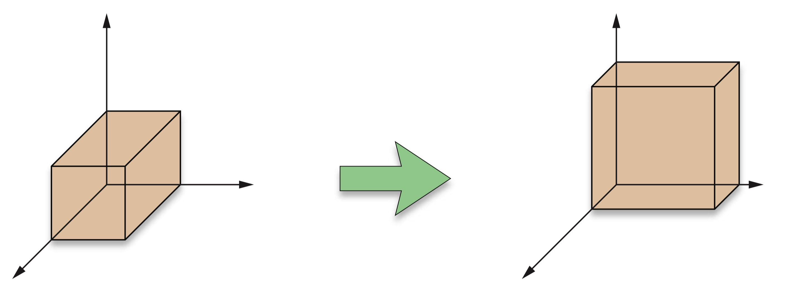  

下面我们推导沿任意三个方向($\vec{u}$,$\vec{v}$,$\vec{w}$)缩放($a$,$b$,$c$)的公式.  

首先从($\vec{x}$,$\vec{y}$,$\vec{z}$)坐标系变换到($\vec{u}$,$\vec{v}$,$\vec{w}$)坐标系，可以由下面矩阵完成:  

$$
\begin{pmatrix}
u_x & v_x & w_x & 0\\
u_y & v_y & w_y & 0\\
u_z & v_z & w_z & 0\\
0   & 0   & 0   & 1\\
\end{pmatrix}^{-1}
$$

接着在($\vec{u}$,$\vec{v}$,$\vec{w}$)下缩放($a$,$b$,$c$):  

$$
\begin{pmatrix}
a   & 0   & 0   & 0\\
0   & b   & 0   & 0\\
0   & 0   & c   & 0\\
0   & 0   & 0   & 1\\
\end{pmatrix}
$$

最后从($\vec{u}$,$\vec{v}$,$\vec{w}$)坐标系变换回($\vec{x}$,$\vec{y}$,$\vec{z}$)坐标系:  

$$
\begin{pmatrix}
u_x & v_x & w_x & 0\\
u_y & v_y & w_y & 0\\
u_z & v_z & w_z & 0\\
0   & 0   & 0   & 1\\
\end{pmatrix}
$$

将这三个矩阵相乘就可以得到最终的矩阵:  

$$
M=\begin{pmatrix}
u_x & v_x & w_x & 0\\
u_y & v_y & w_y & 0\\
u_z & v_z & w_z & 0\\
0   & 0   & 0   & 1\\
\end{pmatrix}
\begin{pmatrix}
a   & 0   & 0   & 0\\
0   & b   & 0   & 0\\
0   & 0   & c   & 0\\
0   & 0   & 0   & 1\\
\end{pmatrix}
\begin{pmatrix}
u_x & v_x & w_x & 0\\
u_y & v_y & w_y & 0\\
u_z & v_z & w_z & 0\\
0   & 0   & 0   & 1\\
\end{pmatrix}^{-1}
$$

利用上面的公式，我们来求解沿单位向量$\vec{n}$缩放，缩放系数为$k$的变换矩阵。设: 

$$
\vec{n}=(n_x,n_y,n_z)
$$

$$
n_{x}^2+n_{y}^2+n_{z}^2=1
$$

为了利用公式，我们需要通过$\vec{n}$创建一个坐标系，我们可以利用观察空间小节里的方法创建坐标系，指定:  

$$
\vec{v}_{up}=(0,1,0)
$$

则:  

$$
\vec{u}=\vec{v}_{up}\times\vec{n}=(n_z,0,-n_x)
$$

$$
\vec{v}=\vec{n}\times\vec{u}=(-n_xn_y,n_x^{2}+n_z^{2},-n_yn_z)
$$

将$\vec{u}$,$\vec{v}$,$\vec{n}$带入公式:  

$$
M=
\begin{pmatrix}
n_z  & -n_xn_y         & n_x & 0\\
0    & n_x^{2}+n_z^{2} & n_y & 0\\
-n_x & -n_yn_z         & n_z & 0\\
0   & 0   & 0   & 1\\
\end{pmatrix}
\begin{pmatrix}
1   & 0   & 0   & 0\\
0   & 1   & 0   & 0\\
0   & 0   & k   & 0\\
0   & 0   & 0   & 1\\
\end{pmatrix}
\begin{pmatrix}
n_z  & -n_xn_y         & n_x & 0\\
0    & n_x^{2}+n_z^{2} & n_y & 0\\
-n_x & -n_yn_z         & n_z & 0\\
0    & 0               & 0   & 1\\
\end{pmatrix}^{-1}
$$

$$
M=
\begin{pmatrix}
1+(k-1)n_x^2  & (k-1)n_xn_y & (k-1)n_xn_z & 0\\
(k-1)n_xn_y   & 1+(k-1)n_y^{2} & (k-1)n_yn_z & 0\\
(k-1)n_xn_z & (k-1)n_yn_z         & 1+(k-1)n_z^2 & 0\\
0   & 0   & 0   & 1\\
\end{pmatrix}
$$

#### 3.3 旋转

确定一个3维空间里的旋转需要3个变量:  
1. 不动点，旋转前后位置保持不变。
2. 绕哪个向量旋转。
3. 旋转角度。从向量的顶部向尾部看去，逆时针为正值，顺时针为负值。

我们先考察最简单的情形：不动点为坐标原点，绕z轴旋转。如下图所示:  

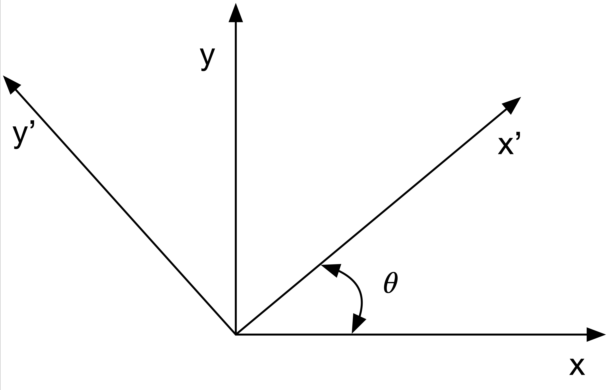  

从上图已知: 

$$
\vec{x'}=(\cos\theta, \sin\theta, 0, 0)
$$

$$
\vec{y'}=(-\sin\theta, \cos\theta, 0, 0)
$$

所以绕$z$轴旋转$\theta$的变换矩阵为: 

$$
Rotate_z(\theta)=
\begin{pmatrix}
\cos\theta & -\sin\theta & 0 & 0\\
\sin\theta & \cos\theta  & 0 & 0\\
0          & 0             & 1 & 0\\
0          & 0             & 0 & 1
\end{pmatrix}
$$

同理，我们可以得到绕$x$,$y$轴的旋转矩阵:  

$$
Rotate_x(\theta)=
\begin{pmatrix}
1          & 0           & 0           & 0\\
0          &\cos\theta   & -\sin\theta & 0\\
0          & \sin\theta  & \cos\theta  & 0\\
0          & 0           & 0           & 1
\end{pmatrix}
$$

$$
Rotate_y(\theta)=
\begin{pmatrix}
\cos\theta  & 0           & \sin\theta & 0\\
0           & 1           & 0          & 0\\
-\sin\theta & 0           & \cos\theta & 0\\
0           & 0           & 0 & 1
\end{pmatrix}
$$

下面我们推导不动点为原点，绕单位向量$\vec{A}$旋转$\theta$的变换公式，如下图所示:  

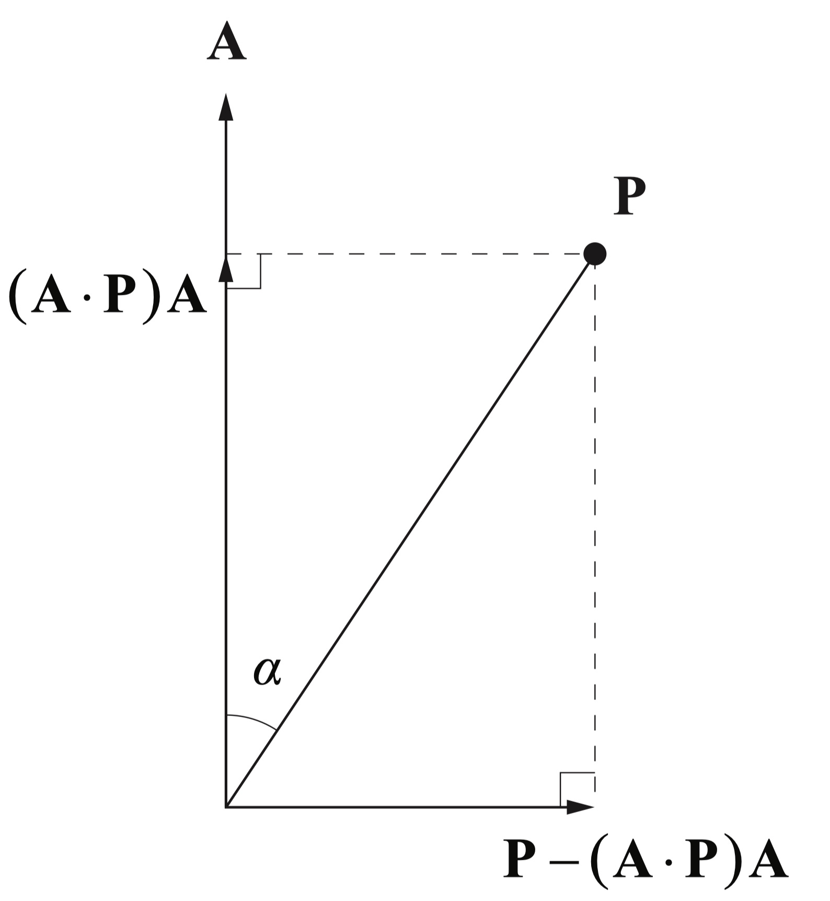  

将$\vec{P}$分解为垂直$\vec{A}$与平行$\vec{A}$的两个分量，旋转不影响平行分量，只影响垂直分量。旋转后的垂直分量为:  

$$
\vec{P_v}=(\vec{P}-(\vec{A}\cdot\vec{P})\vec{A})\cos\theta+\vec{A}\times\vec{P}\sin\theta
$$

$$
\vec{P'}=\vec{P}_{v}+(\vec{A}\cdot\vec{P})\vec{A}
$$

$$
\vec{P'}=\cos\theta\vec{P}+\sin\theta\vec{A}\times\vec{P}+(1-\cos\theta)(\vec{A}\cdot\vec{P})\vec{A}
$$

由前面的数学知识可知:  

$$
\vec{A}\times\vec{P}=
\begin{pmatrix}
0 & -A_z & A_y\\
A_z & 0 & -A_x\\
-A_y & A_x & 0
\end{pmatrix}\vec{P}
$$

$$
(\vec{A}\cdot\vec{P})\vec{A}=\vec{A}(\vec{A}\cdot\vec{P})=\vec{A}(\vec{A}^T\vec{P})=\vec{A}\vec{A}^T\vec{P}
$$

$$
(\vec{A}\cdot\vec{P})\vec{A}=
\begin{pmatrix}
A_x^2 & A_xA_y & A_xA_z\\
A_xA_y & A_y^2 & A_yA_z\\
A_xA_z & A_yA_z & A_z^2
\end{pmatrix}\vec{P}
$$  

带入后得到: 

$$
Rotate_{\vec{A}}(\theta)=
\begin{pmatrix}
c+(1-c)A_x^2 & (1-c)A_xA_y-sA_z & (1-c)A_xA_z+sA_y\\
(1-c)A_xA_y+s A_z & c+(1-c)A_y^2 & (1-c)A_yA_z-s A_x\\
(1-c)A_xA_z-s A_y & (1-c)A_yA_z+s A_x & c+(1-c)A_z^2
\end{pmatrix}
$$  

其中:

$$
c=\cos\theta
$$

$$
s=\sin\theta
$$  

#### 3.4 平移

平移变换非常简单，公式如下: 

$$
T=
\begin{pmatrix}
1 & 0 & 0 & T_x\\
0 & 1 & 0 & T_y\\
0 & 0 & 1 & T_z\\
0 & 0 & 0 & 1
\end{pmatrix}
$$

#### 3.5 长方体变换

长方体变换是指从任意一个长方体变换为另一个长方体，变换前后每个顶点一一对应

长方体只要通过两个顶点就可以唯一确定，设这两个顶点为:

$$
(x_l,y_l,z_l)
$$

$$
(x_h,y_h,z_h)
$$

变换后对应的顶点为:

$$
(x'_l,y'_l,z'_l)
$$

$$
(x'_h,y'_h,z'_h)
$$

由前面几个小节的可知，这个变换可以通过平移、缩放完成，变换的过程如下图所示:

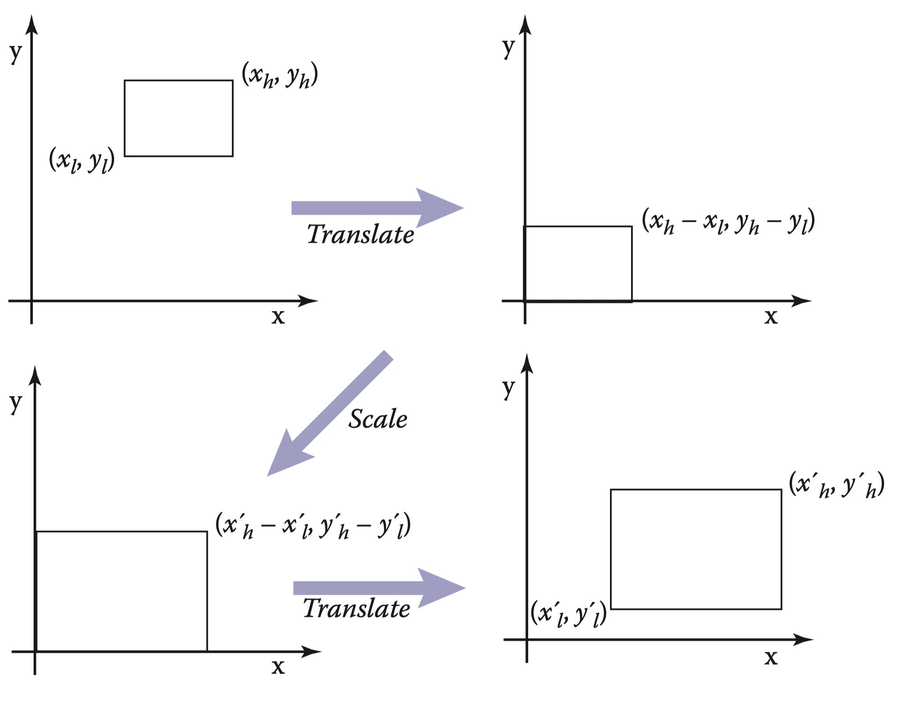  

所以变换矩阵为: 

$$
M=
\begin{pmatrix}
1 & 0 & 0 & x'_l\\
0 & 1 & 0 & y'_l\\
0 & 0 & 1 & z'_l\\
0 & 0 & 0 & 1
\end{pmatrix}
\begin{pmatrix}
\frac{x'_h-x'_l}{x_h-x_l} & 0 & 0 & 0\\
0 & \frac{y'_h-y'_l}{y_h-y_l} & 0 & 0\\
0 & 0 & \frac{z'_h-z'_l}{z_h-z_l} & 0\\
0 & 0 & 0 & 1
\end{pmatrix}
\begin{pmatrix}
1 & 0 & 0 & -x_l\\
0 & 1 & 0 & -y_l\\
0 & 0 & 1 & -z_l\\
0 & 0 & 0 & 1
\end{pmatrix}
$$

化简得:  

$$
M=
\left(
\begin{array}{cccc}
 \frac{x_h'-x_l'}{x_h-x_l} & 0 & 0 & \frac{x_h x_l'-x_l x_h'}{x_h-x_l} \\
 0 & \frac{y_h'-y_l'}{y_h-y_l} & 0 & \frac{y_h y_l'-y_l y_h'}{y_h-y_l} \\
 0 & 0 & \frac{z_h'-z_l'}{z_h-z_l} & \frac{z_h z_l'-z_l z_h'}{z_h-z_l} \\
 0 & 0 & 0 & 1 \\
\end{array}
\right)
$$

#### 3.6 透视变换

透视变换由3部分组成，投影中心，投影平面和被投影物体。将投影中心和被投影物体相连，与投影平面所交的点就是投影点。

我们按如下规则建立坐标系：投影中心是坐标系的原点，投影平面平行与z轴且在z轴的负半部分，投影中心到投影平面的距离为$d$($d>0$)，如下图所示: 

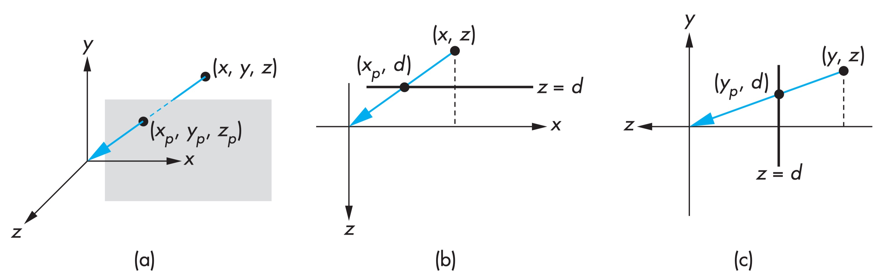  

由上图可知，投影点与被投影点有如下关系:

$$
x_p=\frac{d}{-z}x
$$

$$
y_p=\frac{d}{-z}y
$$

$$
z_p=-d
$$

$(x_p,y_p,z_p)$对应的齐次坐标为:

$$
(-zx_p,-zy_p,dz,-z)=(dx,dy,dz,-z)
$$

写成矩阵的形式:  

$$
P_p=\begin{pmatrix}
d & 0 & 0 & 0\\
0 & d & 0 & 0\\
0 & 0 & d & 0\\
0 & 0 & -1 & 0\\
\end{pmatrix}P
$$

并不是所有的物体都会在最后图像里显示出来，只有在一定范围内的物体会被显示，这个范围在观察空间是一个截头锥体(frustum)，也被称为视见体，如下图所示:

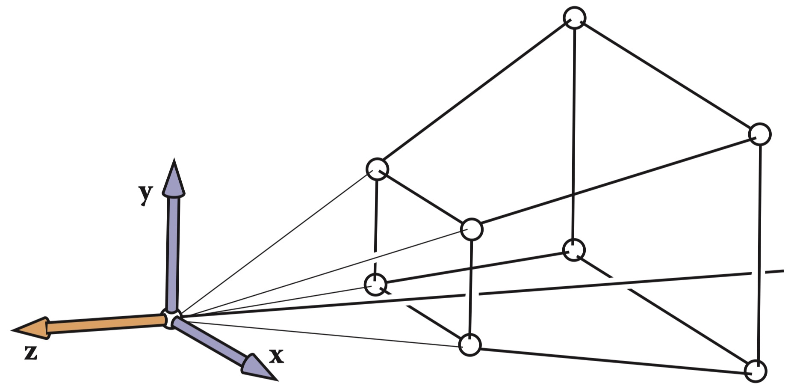 

视见体可以由6个参数确定:

$$
(l,r,b,t,-n,-f)
$$

两个平行于z轴的面称为近裁剪面和远裁剪面，到原点的距离分别为$n$,$f$
$l$,$r$为近裁剪面左右两条边的x轴坐标，$t$,$b$为近裁剪面上下两条边的y轴坐标。

在图形学中，一般把近裁剪面设置为投影平面，则$d=n$。

上面我们得到了透视投影的矩阵，但这个矩阵丢失了所有z轴坐标，我们希望透视矩阵具有如下性质:  
1. 在视见体内，z轴的相对大小保持不变，即$z_1<z_2$，变换后仍然有$z_1'<z_2'$
2. 近、远裁剪面上的点的z轴坐标保持不变。即$z_1=-n,z_2=-f$，变换后仍为$z_1'=-n,z_2'=-f$

我们设该矩阵为:

$$
M=\begin{pmatrix}
n & 0 & 0 & 0\\
0 & n & 0 & 0\\
0 & 0 & \alpha & \beta\\
0 & 0 & -1 & 0\\
\end{pmatrix}
$$

根据条件2，我们可以得到如下方程组: 

$$
\begin{cases}
-\alpha+\frac{\beta}{n}=-n \\
-\alpha+\frac{\beta}{f}=-f \\
\end{cases}
$$

解方程组可得:  

$$
\begin{cases}
\alpha=f+n \\
\beta=fn \\
\end{cases}
$$

现在我们证明所得矩阵满足条件1，变换后得z轴坐标为:  

$$
z'=-(f+n)-\frac{fn}{z}
$$

$$
z'_1-z'_2=\frac{fn}{z_2}-\frac{fn}{z_1}
$$

因为

$$
n>0,f>0,z_1<z_2,z_1<0,z_2<0
$$

所以

$$
z_1'<z_2'
$$

满足条件1。因此得到透视矩阵为:

$$
M=\begin{pmatrix}
n & 0 & 0 & 0\\
0 & n & 0 & 0\\
0 & 0 & f+n & fn\\
0 & 0 & -1 & 0\\
\end{pmatrix}
$$

视见体经过上面的矩阵变换后得到是一个长方体，如下图所示:  

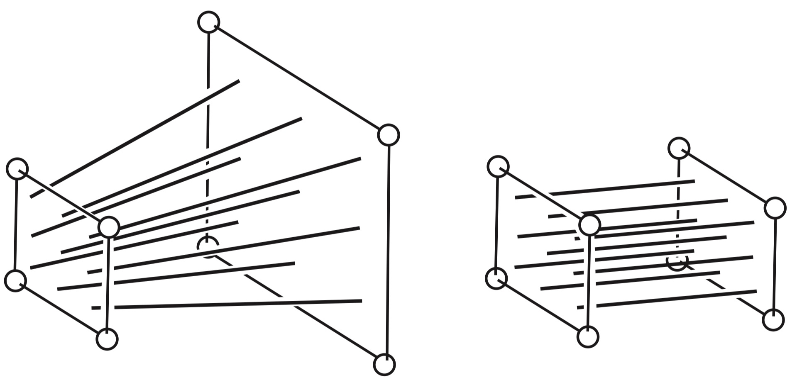 

根据2.4节可知，我们还需要把刚才得到长方体变换为规范视见体(Canonical View Volume)。
在图形学中，我们把近裁剪面变换到$z=-1$平面，把远裁剪面变换到$z=1$平面上。因此为了套用上面得到的长方体变换公式，我们需要先对z轴做一次反射，即乘以下面这个矩阵:

$$
\begin{pmatrix}
1 & 0 & 0  & 0\\
0 & 1 & 0  & 0\\
0 & 0 & -1 & 0\\
0 & 0 & 0  & 1\\
\end{pmatrix}
$$

经过透视矩阵、反射矩阵变换后得到的长方体坐标为: 

$$
x_l=l
$$

$$
x_r=r
$$

$$
y_l=b
$$

$$
y_h=t
$$

$$
z_l=n
$$

$$
z_h=f
$$

因此可以得到长方体变换矩阵: 

$$
\left(
\begin{array}{cccc}
 \frac{2}{r-l} & 0 & 0 & -\frac{l+r}{r-l} \\
 0 & \frac{2}{t-b} & 0 & -\frac{b+t}{t-b} \\
 0 & 0 & \frac{2}{f-n} & -\frac{f+n}{f-n} \\
 0 & 0 & 0 & 1 \\
\end{array}
\right)
$$

最后将三个矩阵相乘，我们就得到了从观察空间的截头锥体(frustum)变换为规范视见体(Canonical View Volume)的矩阵:  

$$
M=
\left(
\begin{array}{cccc}
 \frac{2}{r-l} & 0 & 0 & -\frac{l+r}{r-l} \\
 0 & \frac{2}{t-b} & 0 & -\frac{b+t}{t-b} \\
 0 & 0 & \frac{2}{f-n} & -\frac{f+n}{f-n} \\
 0 & 0 & 0 & 1 \\
\end{array}
\right)
\begin{pmatrix}
1 & 0 & 0 & 0\\
0 & 1 & 0 & 0\\
0 & 0 & -1 & 0\\
0 & 0 & 0 & 1\\
\end{pmatrix}
\begin{pmatrix}
n & 0 & 0 & 0\\
0 & n & 0 & 0\\
0 & 0 & f+n & fn\\
0 & 0 & -1 & 0\\
\end{pmatrix}
$$

$$
M=\left(
\begin{array}{cccc}
 \frac{2 n}{r-l} & 0 & \frac{l+r}{r-l} & 0 \\
 0 & \frac{2 n}{t-b} & \frac{b+t}{t-b} & 0 \\
 0 & 0 & -\frac{f+n}{f-n} & -\frac{2 f n}{f-n} \\
 0 & 0 & -1 & 0 \\
\end{array}
\right)
$$

下图显示了将观察空间里的z轴如何映射到裁剪空间:

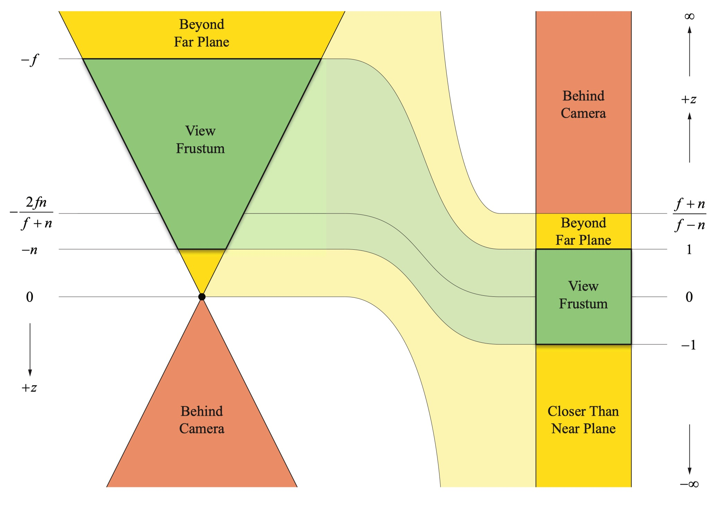 

#### 3.7 视口变换

视口变换是将NDC空间中的坐标变换到屏幕坐标系，单位是像素。实际上视口变换是一个长方体变换。设视口参数为:

$$
viewport=(x,y,w,h)
$$

$x$,$y$为视口的原点，$w$,$h$为视口的宽高，则变换前的长方体参数为:

$$
x_l=-1
$$

$$
x_h=1
$$

$$
y_l=-1
$$

$$
y_h=1
$$

$$
z_l=-1
$$

$$
z_h=1
$$

变换后的长方体参数为:

$$
x_l'=x
$$

$$
x_h'=x+w
$$

$$
y_l'=y
$$

$$
y_h'=y+h
$$

$$
z_l'=z_{min}
$$

$$
z_h'=z_{max}
$$

带入长方体变换公式，得到视口变换矩阵:

$$
M=
\begin{pmatrix}
\frac{w}{2} & 0 & 0 & x+\frac{w}{2}\\
0 & \frac{h}{2} & 0 & y+\frac{h}{2}\\
0 & 0 & \frac{z_{max}-z_{min}}{2} & \frac{z_{max}+z_{min}}{2}\\
0 & 0 & 0 & 1\\
\end{pmatrix}
$$

## 4.总结

本文详细介绍了图形学中常用的数学知识和坐标变换公式，只有理解了这些变换后，才能正确的把物体设置到我们想要的位置。另外不得不提下Mathematica这个软件，本文的推导计算主要靠它完成，非常方便好用，建议大家学习下这款软件。