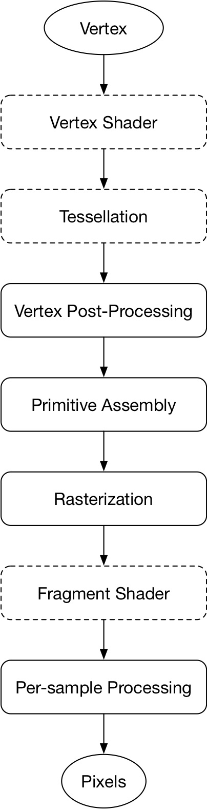

Hello World很可能是绝大多数程序员写的第一个程序，对于图形学程序员也有这样的一个Hello World，那就是画一个三角形。在开始编程之前，我们还需要了解一些其他的东西。

## 1、API

图形学编程中主要有以下几个API：OpenGL、Vulkan、Direct3D、Metal。下面分别介绍。

##### 1、 OpenGL

历史悠久的图形学API，由[Khronos Group](https://www.khronos.org)维护，拥有着最好的跨平台特性，几乎所有的主流平台都支持它，但因为一些历史原因，目前有些不太适应如今的多核时代，但如果你想让你的代码能在各个平台上运行，除了它以外别无选择。OpenGL有着极其丰富的教程资源，如果放在以前，我一定会选择它作来入门。

##### 2、Vulkan

Vulkan同样由[Khronos Group](https://www.khronos.org)维护，是基于AMD的[Mantle](https://zh.wikipedia.org/wiki/Mantle_(API))构建的，它与OpenGL相比，是一个更加底层的API，能充分利用多个CPU核心，有着更高的执行效率，当然学习曲线也更加陡峭。在跨平台方面，它不如OpenGL，是的，苹果不带它玩，你没法在macOS、iOS上直接使用它，但可以通过[MoltenVK](https://github.com/KhronosGroup/MoltenVK)来实现。

##### 3、Direct3D

Windows平台上的图形学API，如果你想从事PC游戏软件开发，学习Direct3D是一个很好的选择。

##### 4、Metal

Apple在2014年的WWDC上公布了Metal，它是一个兼顾图形与计算功能的，面向底层、低开销的API。

选择Metal作为入门的API有以下几个原因：

1、iOS、macOS虽然支持OpenGL，但实际上已经有几年的时间没有维护了,2018 WWDC苹果宣布废弃OpenGL，有兴趣的可以看看Hacker News上的[讨论](https://news.ycombinator.com/item?id=17231442)。我猜在macOS上Apple不敢彻底移除OpenGL，但在iOS上Apple是有可能的。  

2、在macOS上，与Metal相关的工具链很完善，每年都在不断的改进，另外作为一名iOS开发，各种工具都已经很熟悉了，开箱即用，不会在环境配置上浪费时间，可以把经精力集中在图形学的学习上。

3、Metal的设计与Vulkan上相似，都是比OpenGL更加低级的API，同时它的学习曲线比Vulkan平缓，学习Metal对日后学习Vulkan也有所帮助。

## 2、Rendering Pipeline

渲染实质就是这样一个过程，输入一组对象，输出一组像素。根据顺序的不同，渲染大致可以分为两类算法：image order rendering和object order rendering

image order rendering遍历每个像素，找到对这个像素有影响的所有物体，并计算颜色。光线追踪就是一种image order rendering算法。image order rendering渲染的优势是能实现照片级别的渲染，实现更为逼真的阴影、发射等效果。缺点就是计算量大，无法实现实时渲染。(2018.8.20，Nvidia发布了GeForce RTX 20 Series系列显卡，这是世界上首块支持实时光线追踪的显卡)

object order rendering则是遍历每个对象，找到所有受这个对象影响的像素，更新这些像素的颜色。它的优点是运行效率高，支持实时渲染。缺点就是渲染效果较差。

Metal是基于object order rendering，所以下面我们介绍基于object order rendering的渲染流水线。Metal流水线如下图所示:

  

[坐标变换](2018/08/04/coordinate-transformation/)
