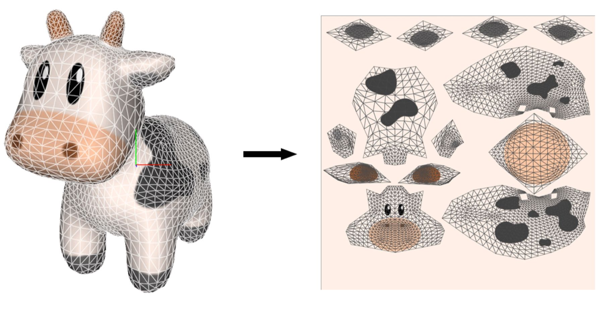

现实世界中的物体表面都有着丰富的细节，例如一块石头表面凹凸不平。这就要求我们在绘制图像时每个像素的属性都应该随着物体表面位置的变化而变化。我们可以通过增加模型的顶点数来达到这样的效果，但这样做效率不高，即使一个简单物体可能都需要非常复杂的模型。而使用纹理映射我们可以在不增加模型复杂度的前提下达到同样的效果。

## 1、纹理映射

纹理映射(Texture Mapping)就是用一张图像存储物体表面的细节，这里的细节可以是渲染方程里的各种参数值，比如diffuse color、normal等，在绘制物体时，将这张图映射到物体表面上。我们可以把这个过程想象为用纸去包装礼物。

纹理映射用数学语言描述如下：

$$
f: (x,y,z)\mapsto(u,v)
$$

$$
u,v\in[0, 1] 
$$

纹理映射f将物体表面坐标(x,y,z)映射到纹理空间(texture space)坐标(u,v)。

一个好的纹理映射一般要尽可能的满足如下需求：
  1、__双射性__。通常我们要求表面上的点要映射到纹理空间中不同的点，除非是想要在表面上重复这个纹理。
  2、__尺寸不畸变__。表面上靠近的两个点在映射到纹理空间时也应该保持差不多大小的距离。
  3、__形状不畸变__。纹理图片不能畸变的太厉害。比如物体表面上一个圆形图案，在映射到纹理空间时不能变为一个方形，或者被拉伸的太厉害。
  4、__连续性__。表面上相邻的两个点在映射到纹理空间时也应该保持相邻。

那么这样的纹理映射如何获得呢？一般都是通过专业的软件在建模时获得。这些专业的软件通过给模型表面添加缝(seam)，将物体表面展开成平面图形(uv unwrapping)，给展开后的每个顶点附上(u,v)坐标，随着模型一起导出。这个[视频](https://www.youtube.com/watch?v=scPSP_U858k)(需fq)就是使用blender来设计纹理映射。

 